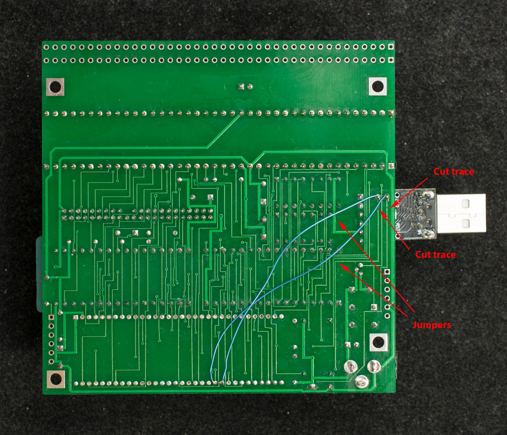

# Engineering Change for RIZ180, rev0
There are two pc board design errors in RIZ180 rev0 that require engineering changes.

1. The DIP64 footprint is incorrect. The actual DIP64 pin spacing is 70mil, but the pc board was lay out with DIP64 pin spacing of 75mil. To fit, the Z80180 DIP64 pins must be spread out progressively and carefully aligned with the holes on pc board.

2. RTS and CTS handshake signals are swapped. Two cut and two jumpers are required to correct the problem. Click on picture below for high resolution photo.

