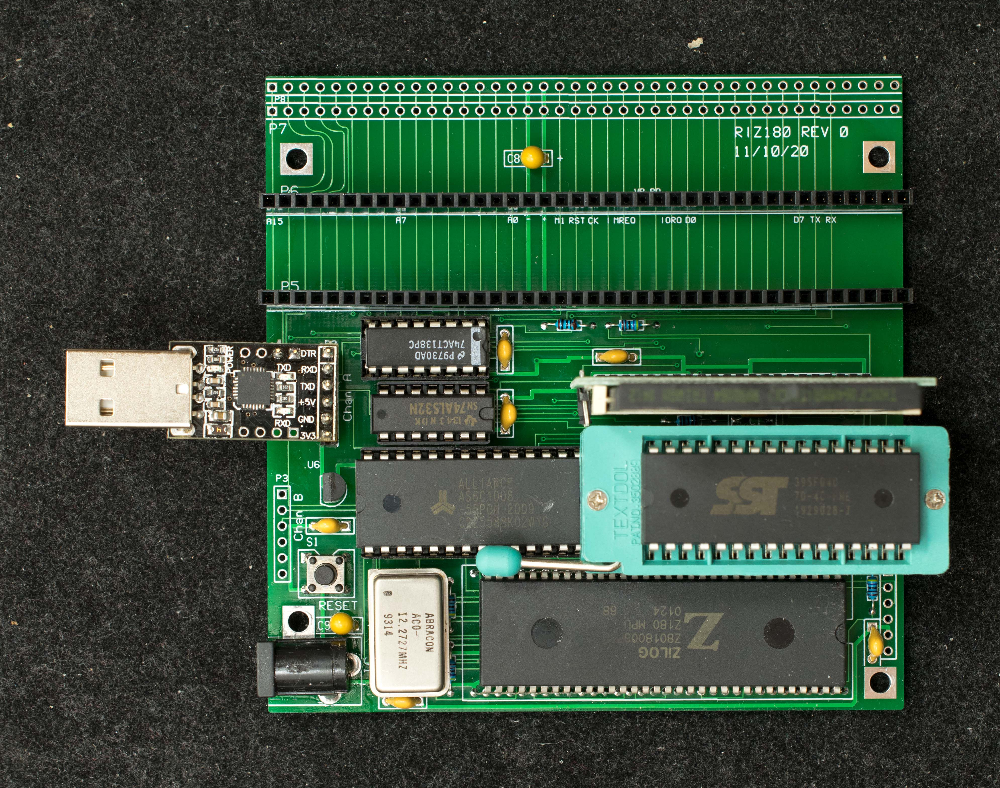
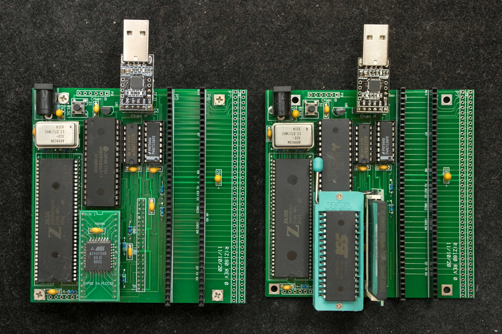
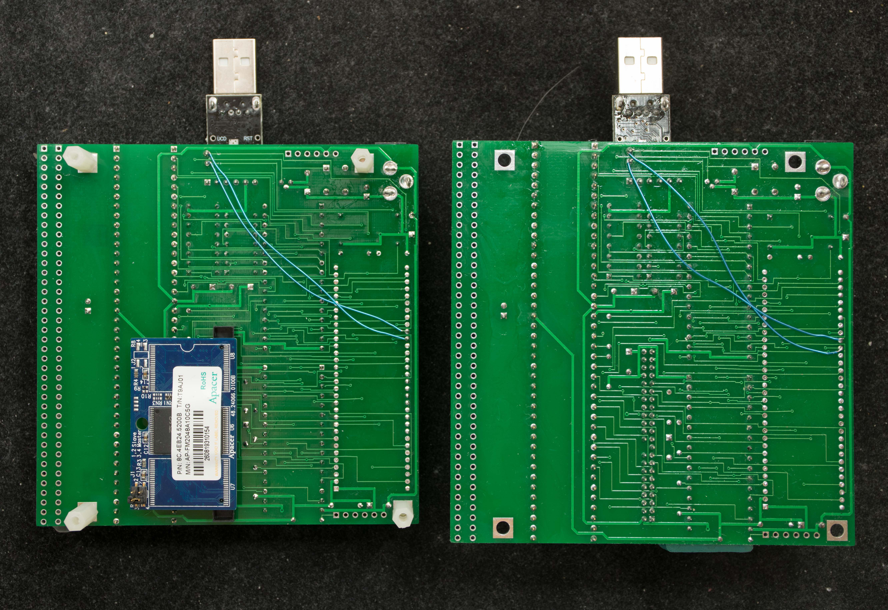
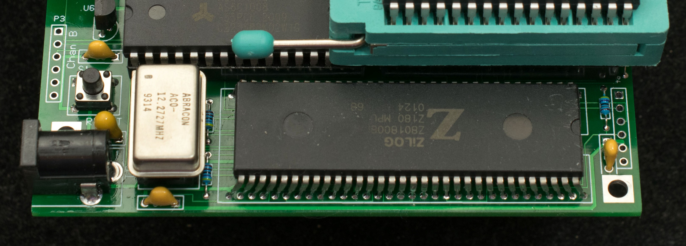
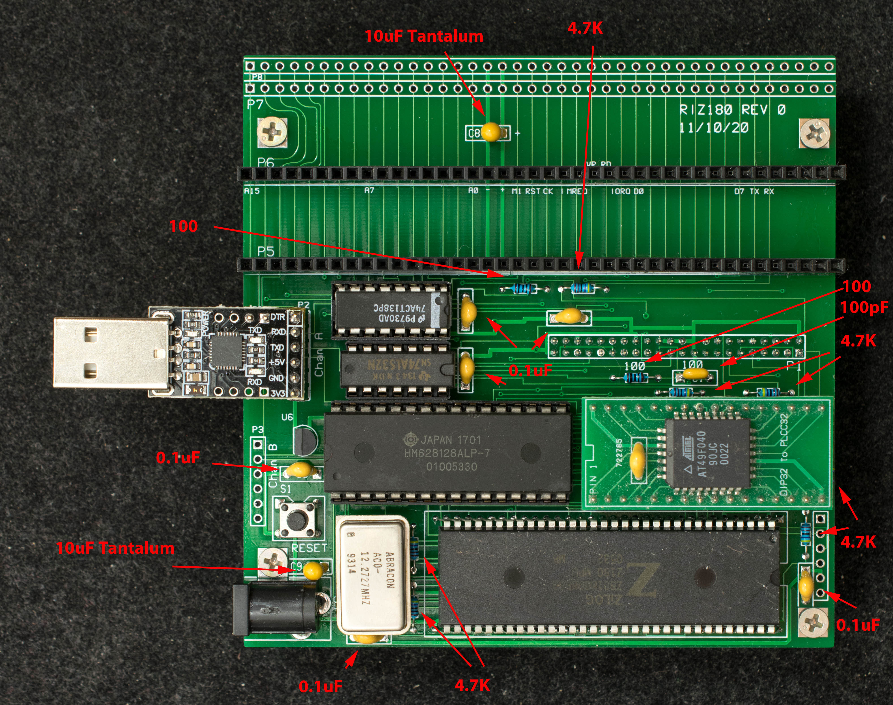

# RIZ180, A Simple Z180 for RC2014
### Introduction
Someone gave me six Z8018008PSC and a request to build a cheap RC2014-compatible SBC with through-hole components and no CPLD. Z180 is so well integrated that seems to be a reasonable request, but I encountered two challenges as I went down the design path:
1. DIP64 is 70mil lead pitch rather than the standard 100mil pitch. I didn't want to solder it directly on newly developed pc board, but fortunately DIP64 socket with 70mil pitch is readily available on eBay and cheaply, except the order takes long time to arrive.
2. Address 19 is not bonded out on DIP64. This makes it difficult to run ROMWBW with direct memory mapping. I made a design decision to not run ROMWBW, but port CP/M2.2 and CP/M3 by rework existing Z80 software

I name the board RIZ180, after the person who gave me the parts.

### Features
- Z80180 at 7.37MHz
- 128K RAM
- 128K EPROM
- IDE44 for compact flash drive or DOM
- 2 serial ports, 1 SPI port
- 3 RC2014 expansion slots plus a RC2014 backplane extender
- All through-hole components, no CPLD
- 4“x4” 2-layer PC board
- CP/M2.2 and CP/M 3 ready

Z180 is so well integrated, it almost needs no glue logic, almost. Can't get around needing a 2-input OR gate for RAM/EPROM decoding, so I might as well added a 74138 to have a CF interface. Disk-on-module (DOM) interface is mirror image of CF interface, so with 1/2“ standoffs and 90 degree connector, a DOM disk can be mounted on the bottom of the board.

Z180 has 2 serial ports and a SPI port. Channel A of the serial port has handshake signals. The handshakes have caused so many problems that I designed channel A specifically for CP2102 USB adapter which is inexpensive and have a proven handshake function.

RIZ180 can accommodate either a compact flash or a disk-on-module (DOM). The connection definition of DOM is mirrored of CF, so a DOM needs to be on the solder side of the board as shown in the two pictures below.

### Design Information
- [Schematic](riz180_rev0_scm.pdf)
- [Gerber photoplots](riz180_rev0_gerber.zip)
- [Bill of Materials](riz180_r0_bom.pdf)
- [Engineering changes](RIZ180_rev0_EC.md) for rev0 pc board

RIZ180 rev0 footprint error

### Software
- [RIZMon](Software/rizmon_v0_5.zip) is a simple monitor for RIZ180. The serial port setting for 12.288MHz clock is 38400 N81
- [P/M2.2 for RIZ180](Software/riz180_cpm22.zip). This is work in progress, the XMODEM is not working correctly.

### Board Assembly

Picture above shows the resistor and capacitor values for RIZ180 pc board.
