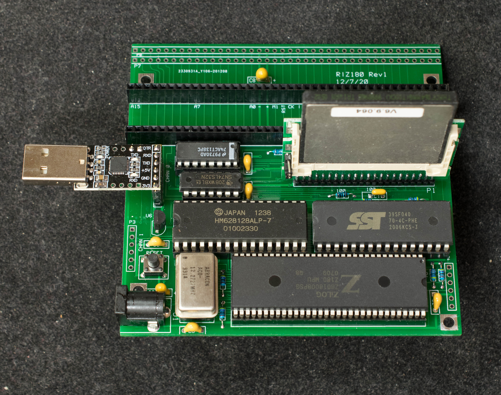
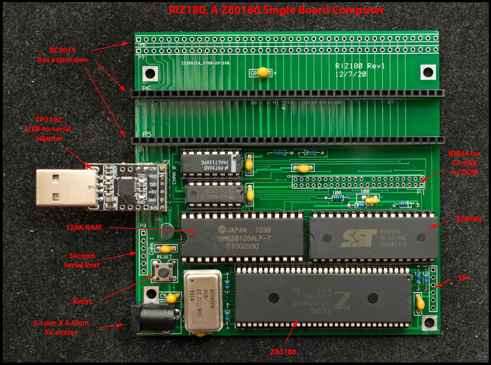

# RIZ180 Rev1, A Simple Z180 SBC for RC2014
### Introduction
RIZ180 is named after the person who gave me six Z8018008PSC and a request to build a cheap RC2014-compatible SBC with through-hole components and no CPLD.

### Features
- Z80180 at 9.22 MHz
- 128K RAM
- 128K EPROM
- IDE44 for compact flash drive or DOM
- 2 serial ports, 1 SPI port
- 3 RC2014 expansion slots plus a RC2014 backplane extender
- All through-hole components, no CPLD
- 4“x4” 2-layer PC board
- CP/M2.2 and CP/M 3 ready

### Design Approach
Z180 is so well integrated, it almost needs no glue logic, almost. Can't get around needing a 2-input OR gate for RAM/EPROM decoding, so I might as well added a 74138 to have a CF interface. Disk-on-module (DOM) interface is mirror image of CF interface, so with 1/2“ standoffs and 90 degree connector, a DOM disk can be mounted on the bottom of the board.

Z180 has 2 serial ports and a SPI port. Channel A of the serial port has handshake signals. The handshakes have caused so many problems that I designed channel A specifically for CP2102 USB adapter which is inexpensive and have a proven handshake function.

### Design Information
- [Schematic](../Rev0/riz180_rev0_scm.pdf) ← this is same as rev0 schematic
- [Gerber photoplots](riz180_gerber_rev1.zip)
- [Bill of Materials](../Rev0/riz180_r0_bom.pdf) <- same as rev0 BOM

### Software
- RIZMon is a simple monitor for RIZ180. The serial port setting for 18.432MHz clock is 57600 N81
- CP/M2.2 for RIZ180. To install it, send cpm22all.hex to RIZ180 and type 'c2' to install it in track 0 of CF disk. Once it is installed, type 'b2' to load and run CP/M2.2
- XMODEM.HEX. This is the very first program in a new RIZ180 CF disk. Install CP/M2.2 above first, then while in RIZ180 Monitor, send xmodem.hex to RIZ180; then type 'b2' to enter CP/M2.2; then type 'save 17 xmodem.com' at CP/M prompt. This will save the RAM image into a file called xmodem.com. For proper operation with XMODEM, hardware handshakes need to be enabled for the serial port.
- unarj.com. This is file decompression program running in CP/M. Use it to decompress .arj files
- cpm22dri. This is the CP/M2.2 distribution files from Digital Research. Use unarj.com to decompress it.
- Zorkall is Zork1, Zork2, and Zork3 compressed with arj. Use unarj.com above to decompress.
- HTC309 is version 3.09 of HiTech C that has been released into publica domain. It is compressed with arj, use unarj.com above to decompress
- SCMonitor patched for RIZ180. This hex file should be burn into EPROM replacing RIZMon. This is SCMonitor for SC126 patched to run on RIZ180. The difference between SC126 and RIZ180 is the base address of RAM; SC126's RAM is located from 0x80000 to 0xFFFFF whereas RIZ180 RAM is from 0x40000 to 0x5FFFF. By patching the MMU initialization routine at location 0x1D3F where common block 1 is assigned, SCMonitor for SC126 will now run on RIZ180.
- SCMonitor as an application for RIZ180. This hex file is loaded into RIZ180's memory and saved to CF disk as an application using 'c1' command. Afterward it can be recalled into memory and execute by using 'b1' command. This is patched SCMonitor for SC126 where the MMU initialization routine is replaced with NOP instructions.
- SCMonitor + Startrek as an application for RIZ180. This hex file is similar to the file one line above, except the BASIC program has 48K of usable memory and is pre-loaded with StarTrek. To run the pre-loaded StarTrek, warm start BASIC with 'wbasic', then 'run'.
- CPM3ALL . This is the CP/M 3 distribution files. XMODEM cpm3all.arj to drive A of CF disk and use unarj.com to decompress it.
- CP/M3 Loader. This is loader for CP/M3. It expects CPM3.SYS in drive A of the CF disk. First install CPM3ALL above in drive A of the CF disk. To install CP/M3 loader, send CPM3LDR.HEX to RIZ180 and type 'c3' to install it in track 0 of CF disk. Once it is installed, type 'b3' to boot CP/M3.
- CPM3 banked BIOS source code, assembled with zmac

### Manuals and Instructions
- Pictorial assembly guide
- [Z80180 datasheet](Manuals/z180_datasheet.pdf)

### ToDo
SCMonitor
CP/M3
RIZMon instruction
Getting started guide
